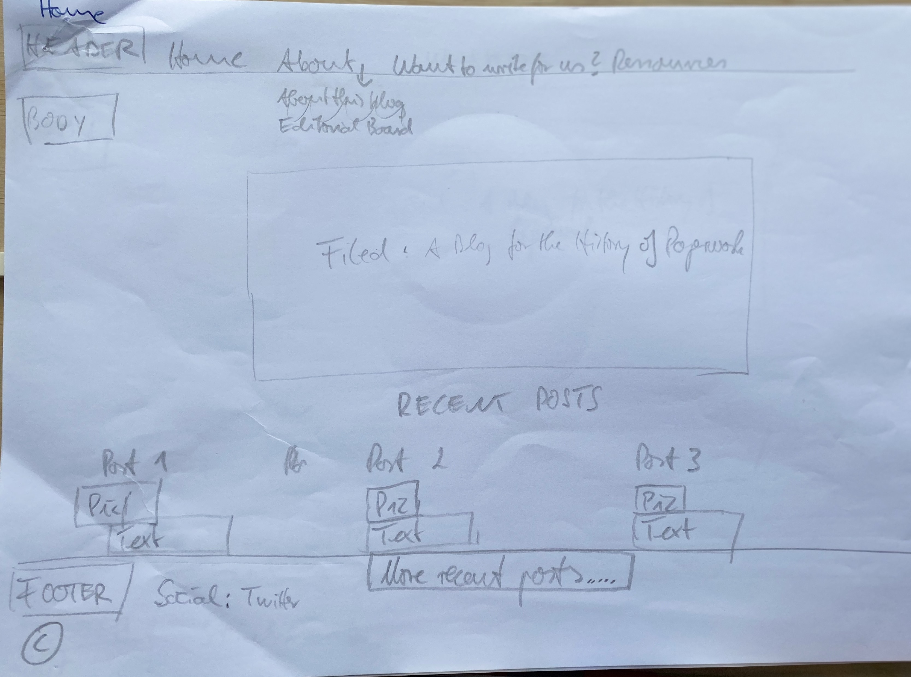
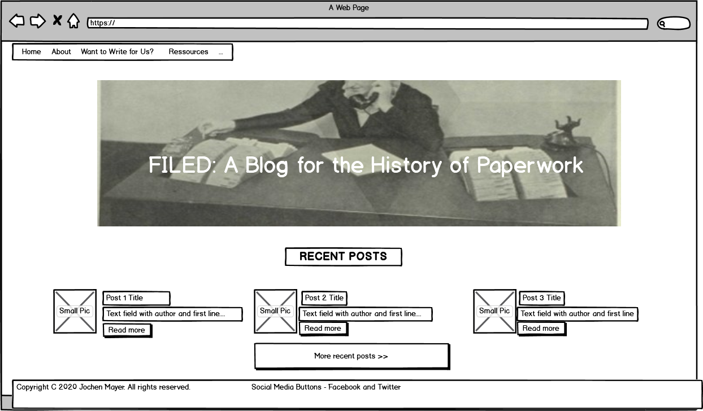
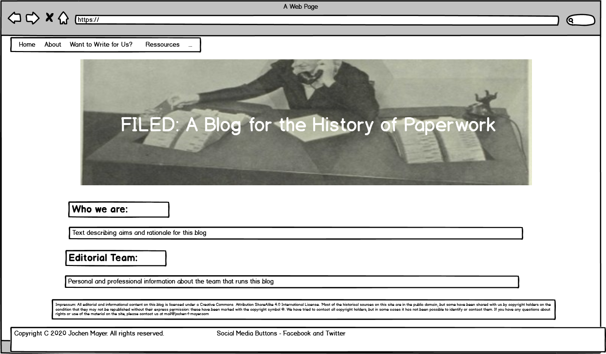
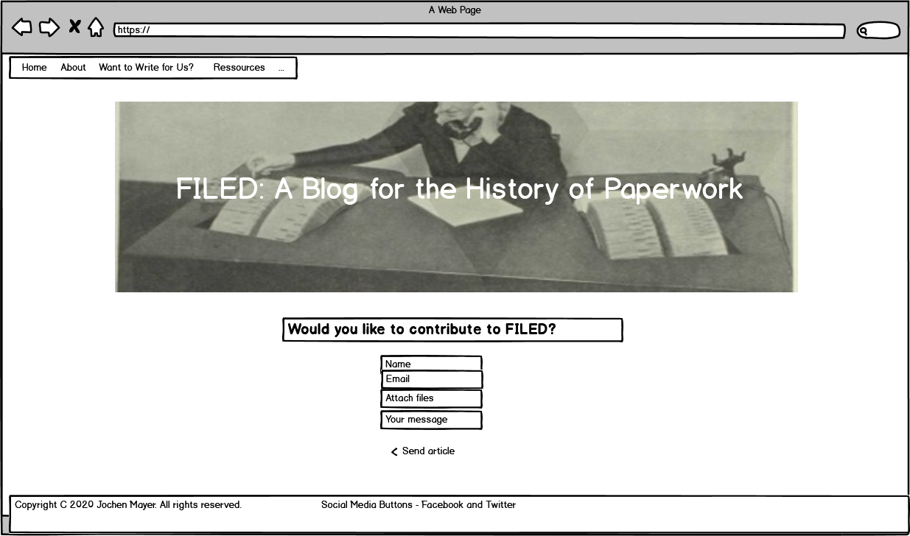
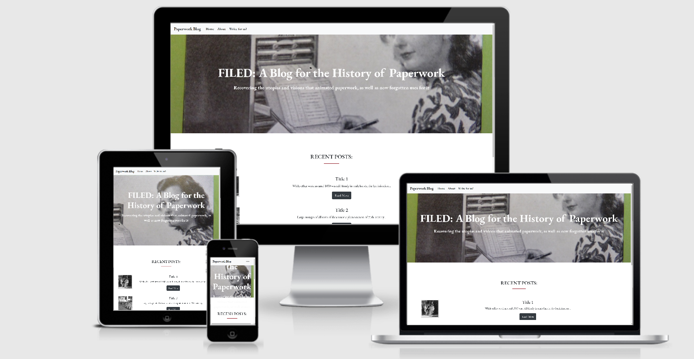

# FILED: A Blog for the History of Paperwork #

Following a number of dispersed publications, historical scholarship in the field of history of (bureaucratic) 
paperwork has been gathering momentum over the past 10 years or so, and so has academic blogging in History, shifting from a sort of hobby 
to a professional and potentially highly rewarding activity giving current historical scholarship an accessible public face. 
This blog for the first time brings together both - the history of paperwork and blogging - and aims to develop into a high-quality collaborative, 
international, and peer-reviewed blog.

I am most interested in bringing together scholarship on paperwork oriented toward practical, rather than literary ends – all documents produced in response 
to a demand (real or imagined) by an office, the law, a lab, or similar organizational entity comprising technologies that now have become the iconic repertoire from which graphical computer interfaces are assembled: forms, manila folder, 
keyboard, filing cabinet etc., as not least this blog testifies.

The main aims of this blog are:

* get people inside and outside academia thinking about paperwork in the past and in the present;

* bring together scholarship and facilitate deeper discussions among librarians, historians, curators, & archivists 
around all aspects of pre-electric data management & material cultures involved;

* help consolidate history of paperwork as an identifiable subfield within historical scholarship.

## UX ##

The idea for this blog predates my enrolment at CI, yet upon studying the course material I have carried with me the idea of using Milestone Project 1 to have a first shot
at implementing it. 
To my knowledge, there is no blog of such kind out there yet. Derek Dunne, a colleague with whom I have been exchanging ideas about my blog in May, started to gather resources 
for a similar project entitled [Literature & Bureaucracy from Shakespeare to Kafka](https://twitter.com/DerekVindice/status/1259782834409164800). 

There are similarities between his project and mine and I am excited to see what comes of his, yet his project is first and foremost designed as a 
research network comprising conferences and other forms of academic collaborations, and, as far as I am 
aware, there is no plan of adding a blog to these ends. 

Also, his project is more specifically concerned with "literature's response and/or resistance to 
the growth of bureaucracy", as is mentioned in Derek's initial [call](https://twitter.com/DerekVindice/status/1259782834409164800/photo/1) and focuses on 
an earlier period than mine, namely Renaissance/early modern period (pre-1700). 

In terms of blog title (and future URL), I first opted for "Notes on Paper: A Blog for the History of Paperwork" and "Paper Tales: A Blog for the History of Paperwork" which both nicely 
capture my main idea of writing and editing tales about paper for a broader readership. A third option was "Paper Trails: A Blog for the History of Paperwork" - beautifully 
encapsulating in the title one of the main functions of paperwork which is also a concern here: the seriality of written documents, especially when it comes to documenting 
re-occuring events or activities of an organization.   
A quick search on google quickly showed, however, that all three titles (URLs) had been taken up already for varying purposes and audiences.

[Notes on Paper](http://notesonpaper.blogspot.com/) is a personal blog, while 'Paper Tales' is used by a number of blogs on paper art and craft, such as [My Paper Tales](http://mypapertales.blogspot.com/), [Paper Tales](https://www.papertales.co.za/), 
and [Paper Tales](http://www.papertales.com/) \[sic!\]

'Paper trails', on the other hand, has been used as a title for an ongoing scholarly 
[publication project](https://blogs.ucl.ac.uk/special-collections/2019/08/23/call-for-papers-for-paper-trails-a-new-open-access-publication-with-ucl-press/) at University College London,
and is the product name of a cloud-hosted [log management system](https://www.papertrail.com/).

In the face of such rather crowded online space, I decided to go with "Filed: A Blog for the History of Paperwork" instead. 
The reference to 'files' in the title is not a bad choice in the end, as it allows us to immediately point readership to the main focus of this blog: 
the file in its more standardized formats as arguably the most basic unit of paperwork - an idea which neither 'paper tales' nor 'paper trails' convey in the same manner.

In preparation for this project, I sent out a [first call for contributors](https://twitter.com/jochenfm/status/1255194721208741890) on 28 April in form of a twitter thread, stating my main ideas 
for this blog encouraging my 'followers' to spread the word and send their statements of interest to me via email. 

Response to my call was overwhelmingly positive across the ranks of the scholarly community. I also received a number of 
suggestions from colleagues of how to improve on the initial ideas and who/what else to include in this blog, such as a bibliography to gather pertinent literature 
in one place online. Recruitment is still ongoing but, currently two colleagues - [James Purdon](https://www.st-andrews.ac.uk/english/people/jjp5) and [Chris A. Williams](http://www.open.ac.uk/people/caw322) - have 
comitted to the cause and we are currently in the process of dividing responsibilities and assigning roles (as co-editors, reviewers, and/or advisors).
We also agreed that the editing and advisory team needs to be more inclusive and diverse in terms of gender and ethnicity in response to which I launched a 
[second call](https://twitter.com/jochenfm/status/1279396434635370496) on July 4 recitifying this significant oversight in my first call by explicitly addressing 
work by scholars and activists of non-white and post-colonial background. I also added a 
google [excel spreadsheet](https://docs.google.com/spreadsheets/d/1S7NhSFTwzLrkMulq3ERP6cURSmIDVFvC7GLSbo_qzNQ/edit#gid=0) asking potential
contributors to fill in  name, institutional affiliation and their ideas for this blog. 

I subsequently sketched out the wireframes, first by hand, as can be seen from this photo of the index.html page (a PDF with all hand-sketched wireframes combined 
can be accessed via the directory on the left under *wireframes/handsketched_combined.pdf*).

. 

The digital wireframes were done by Balsamiq and look as follows:

 

As can be seen from the depictions above, font, colours, and design choices at that stage were all pretty limited, but the main design choices that can now be found 
on this website were laid down.

The current layout is primarily inspired by a combination of feasibility, based on what we had learned in the three modules thus far, and the desire to recreate 
the design world of early 20th-century office and paper technologies, while adhereing to a clean simple design using lots of space. 

To this aim, the hero image in yellow-green and grey shades, and the Garamond typeface, named for sixteenth-century Parisian engraver Claude Garamond, set the tone.
I added subtle but effective reactions to user actions by hover effects over buttons, images, and the navbar in a matching wine-red. 
I assume that many users coming to this site share my fascination with the now allegedly lost world of paper-based office work and its aesthetics, so the mix of dark grey and an off 
white with rare greenish colour are clearly intended to speak to their aesthetic preferences.

The added colours - inlcuding the block dividers in wine-red - are intentional, however, as I wanted 
to refrain from emulating the illusion of a past in black-and-white only. 

The blogs mentioned in the Acknowledgments below, as well as the CI walkthrough projects ('Whiskey' and 'Rosie') offered some inspiration which I felt capable of implementing, 
such as the landing page and the recent posts field on index.html, and the submission form on contributions.html   

Layout of these sites follow the usual conventions, with navbar at the top and social media links in the footer, and a rough rule-of-three division of all site content, 
so users will find it easy to navigate, with one exception: This may be a sterotype, but historians are almost always in the mood to read so I did not refrain from 
larger paragraphs of text - this is a history blog after all, designed to gather and disseminate mostly textual information on a text-heavy topic.

I expect different user groups to have the following expectations when they come to the site for the first time: 

* As a reader outside the academy, I want to be informed on the topic, especially on how its historical instances tie in with present-day issues 
related to inscriptions, reading, power, and information so that I can become a more responsible and critical citizen;
* As an archivist, museum curator, or historian I want to share my knowledge about files and filing and enter conversation with 
the respective other professional groups who each have their own blind spots on the topic;
* As a contributor, I want to know where I can submit my post safely and securly so I can partake in the widest possible dissemination of my work to foster historical research and debate;  
* As a contributor, I wish to grow my academic network so that I know more about what is being done in the field and know where and how I can contribute to the debates;
* As any of the above user groups, I want this site to look credible and trustworthy;
* As any of the above user groups, I want to quickly find my way around this site, and also know fast how I can contact the relevant editors;
* As any of the above user groups, I want to learn more about the aims and rationale of this blog and its main focus.

## Features ##

### Existing Features ###

- [x] The image on the home page in index.html quickly sets the atmosphere linking design with main content; 
- [x] The 'recent posts' section below the landing page on index.html (once live) will allow users to quickly access the most recent content;
- [x] The social media buttons in the footer will allow users to share the content of this page; 
- [x] about.html allows users to quickly gain an overview of the aims and rationale for this blog and who the editors are, 
their interests and social media profiles, all of which is crucial to get a feel for what they are seeing;
- [x] The impressum on this page set outs the basic copyrights;
- [x] The submit form on contributions.html will allow users to comfortably submit their contribution, by having them fill out the submit form and attach their file. 

### Features left to implement ###

Additional features to be implemented in the coming weeks include:

- [ ] wire up the submit form on contributions.html to an external email interface to be able to receive emails and attachments which will be essential to the purpose of this site.
- [ ] insert ‘search’ form and ‘search’ button on the right hand sight of the navbar, probably taken from Bootstrap and customized further, combined with a searchable database of all posts	
- [ ] create facebook and twitter accounts and put links in footer live;
- [ ] a card or similar entitled 'More recent posts' in index.html with link to more blog posts;
- [ ] add more substantial content under a navbar item Resources, such as a bibliography, autor interviews, and links to related websites and by inserting 
more links in about.html directing to institutional affiliations of and publications by editors and advisors;  
- [ ] these additional pages will have more social media buttons to share content, such as for Tumblr, for printing and for email to friend;
- [ ] ask artist to join and design fitting graphic templates that can be used across the blog;
- [ ] a carousel of images at the top of index.html as done [here](notchesblog.com) or [here](blackcentraleurope.com);
- [ ] a highly visible box or card with contact details for more general queries which are not article submissions;
- [ ] as and when more blog entries will have been posted, I envision to increase the categories under which they are archived (and searchable) beyond the current one of "recent posts"
such as by geographical region, historial period, and theme;
- [ ] expand on the submission form as done [here](http://notchesblog.com/write-for-notches/), for instance, and also insert further specifications of sunmission guidelines in terms of word count, aims, scope and style. 
- [ ] add tooltip from Bootstrap to Data Protection Policy tick box on 'contributions.html' with brief information what these are such as "At no time will we share your data with other 
    people or companies, the data provided will become part of the database of this blog exclusively..." and a link to more information on this which will be stored as a PDF or elsewhere.
- [ ] a comment function under each blog post for readers to share their views with added further data/comments policies;
- [ ] a greater variety of hero images across all sites.

## Technologies Used ##

* [Balsamiq](https://balsamiq.com/)
    * The wireframes for this project were drawn up with **Balsamiq**

* [Google Font](https://fonts.google.com/)
    * The Garamond font is drawn from **Google Fonts**

* [CSS-Tricks](https://css-tricks.com/)
    * This project uses code from **CSS-Tricks** for the [full page background image](https://css-tricks.com/perfect-full-page-background-image/)

*    [Bootstrap](https://getbootstrap.com/)
    * This project is designed and customized with **Bootstrap**.

* [Favicon](https://favicon.io/)
    * The Favicons have been taken from 

* [Stackoverflow](https://stackoverflow.com/)
    * The fontcolour transition on the 'About' page was inspired by code from **Stackoverflow**    

* [Codepen](https://codepen.io/)
*   * The shadows behind pictures on index.html is taken from **Codepen**

* [GitHub](https://github.com) and [Gitpod](https://www.gitpod.io/)

*   * **Github** and **Gitpod** were used to host the software development versions and to create and save the code respectively.

* [Chrome DevTools](https://developers.google.com/web/tools/chrome-devtools)

*   * **Chrome DevTools** built directly into the Google Chrome browser were used constantly thoughout the development cycle.

* [W3C Markup Validation Service](https://validator.w3.org/)

*   * I used both for HTML and CSS to run my code looking for errors.

## Testing ##

Automated and manual testing were conducted during this project. 

1. I used the [W3C CSS Validator](https://jigsaw.w3.org/css-validator/) and the [W3C HTML Validator](https://validator.w3.org/) which returned "Congratulations! No Error Found"
 "Document checking completed. No errors or warnings to show" respectively.

2. I used [AmiResponsiveDesign](.http://ami.responsivedesign.is) to create the following test result: 

. 

As can be seen, all pages, links, icons performed as expected on all devices.

3. Desktop

The site was tested in Google Chrome and Mozilla Firefox browswers and all pages, links on those pages, and footer icon links perform well on all viewport sizes, 
a few minor issues notwithstanding (see below). Developer tools in Chrome were also used during the creation phases for the various viewport sizes.

4. Mobile

I used my Hueawei3 and my wife's iPhone11 and all pages, links, icons performed well on all devices using Chrome and Safari respectively.

5. Bugs

* index.html: 

    * 'Title 3' under 'Recent Posts' has a slight bigger margin to the top than the other two.

* contributions.html:

    * blog divider needs to push down 'Send us your article' a little further;
    * 'Send article' button needs centering on very large and small screen sizes.
    * Sandwich toggler in navbar moves off the right margin towards center, also in about.html but not so in index.html

Due to time constraints on getting this project submitted I'm unable to address them right now but I will attend to them in the coming days.

## Deployment ##

1. I created a Github account under [JochenFM](https://github.com/JochenFM)

2. I committed and pushed all files for this project to my Github repistory [Milestone1](https://github.com/JochenFM/Milestone1)

3. To make my website live and working for other people to look at, I followed the 
steps outlined [here](https://docs.github.com/en/github/working-with-github-pages/configuring-a-publishing-source-for-your-github-pages-site): 
In my repository, I went to 'Settings', then scrolled down to 'Github Pages'. 
Under the Source setting, I used the drop-down menu to select 'master branch' as a publishing source and saved it. 
Upon refreshing the github page, I was issued the url where my page is published, namely "Your site is published at https://jochenfm.github.io/Milestone1/"

To pull my code from my Github repository to run it on another machine, one would go to my [repository](https://github.com/JochenFM/Milestone1) and on the 
main page one would then click the green button 'Code' with a downward pointing arrow, on the right hand side just above the files. This button will give 
options to 'clone with HTTPS', or 'Open with Github Desktop', or 'Download ZIP'. 

To continue with cloning, one would then:

* open Git Bash,
* change the current working directory to the location where one wants the cloned directory to be made,
* type 'git clone', and then paste this URL; https://github.com/JOchenFM/Milestone1 
* press 'Enter' to create the local clone.

See also [here](https://docs.github.com/en/github/creating-cloning-and-archiving-repositories/cloning-a-repository) for more information on the process.

## Credits ##

### Content ###

See some credits are mentioned in my HTML code.

The text for section 'Editorial Team' on the 'Write for us?' site was copied from the editors' respective home/institutional websites 
and partly also provided by the co-editors upon request by email. Text for this section (and others) will be customized
further as we go along.
All other text of this blog was written by me.

### Media ###

The hero image was photographed by me in the archive of 
the [Deutsches Museum Munich](http://www.deutsches-museum.de/archiv/) in January 2018.
The Archive shared the copyright on the condition that it may not be republished without their express permission.
The other photos used in this site were obtained via google image and are free to use or share.

### Acknowledgement ###

My thanks to Code Institute, Brian O'Grady, and especially to Matt Rudge for providing concise and useful course material and for free access to Balsamiq.
Many thanks also to Anna Greaves for her great *How to make a Kick-Ass first Milestone* PDFs, to all the other tutors 
and mentors on Slack for many helpful posts and info, and to the CI's Slack Channels and the many fellow students, tutors, and alumni who contribute to them.

Huge thanks to my mentor [Adegbenga Adeye](https://github.com/deye9) for commenting on earlier versions of my code and for suggesting some crucial layout improvements.

Special thanks to my wife Sheila for pointing out that the greenish colour of the hero image is actually closer to yellow which helped me in finding the matching footer color.

The following history blogs provided inspiration:
* [Black Central Europe](https://blackcentraleurope.com/)
* [AAIHS Black Perspectives](https://www.aaihs.org/black-perspectives/)
* [Littera Visigothica](http://www.litteravisigothica.com/)
* [Shells and Pebbles](www.shellsandpebbles.com) 